# Application Component Flow Diagram

```mermaid
flowchart TD
    %% Main Application Shell
    subgraph App["Main Application (App.tsx)"]
        AppRoot[App Root Component]
        Router[React Router]
        AuthProvider[Authentication Provider]
        QueryClient[TanStack Query Client]
        ThemeProvider[Theme Provider]
        
        AppRoot --> Router
        AppRoot --> AuthProvider
        AppRoot --> QueryClient
        AppRoot --> ThemeProvider
    end
    
    %% Main Layout Components
    subgraph Layout["Layout Components"]
        MainLayout[Main Layout]
        Navigation[Navigation Bar]
        Sidebar[Sidebar Menu]
        Breadcrumbs[Breadcrumb Navigation]
        Footer[Footer]
        
        Router --> MainLayout
        MainLayout --> Navigation
        MainLayout --> Sidebar
        MainLayout --> Breadcrumbs
        MainLayout --> Footer
    end
    
    %% Page Components
    subgraph Pages["Page Components"]
        Dashboard[Dashboard Page]
        Inventory[Inventory Page]
        Orders[Orders Page]
        Sales[Sales Page]
        Quotes[Quotes Page]
        Users[Users Page]
        Settings[Settings Page]
        
        Router --> Dashboard
        Router --> Inventory
        Router --> Orders
        Router --> Sales
        Router --> Quotes
        Router --> Users
        Router --> Settings
    end
    
    %% Feature Components - Inventory
    subgraph InventoryFeatures["Inventory Features"]
        ItemTable[Item Table]
        ItemForm[Item Form]
        ItemDetails[Item Details]
        StockMovement[Stock Movement]
        CategoryManager[Category Manager]
        
        Inventory --> ItemTable
        Inventory --> ItemForm
        Inventory --> ItemDetails
        Inventory --> StockMovement
        Inventory --> CategoryManager
    end
    
    %% Feature Components - Orders
    subgraph OrderFeatures["Order Features"]
        OrderTable[Order Table]
        OrderForm[Create Order Form]
        OrderDetails[Order Details]
        InvoiceUpload[Invoice Upload]
        JSONImport[JSON Import]
        
        Orders --> OrderTable
        Orders --> OrderForm
        Orders --> OrderDetails
        Orders --> InvoiceUpload
        Orders --> JSONImport
    end
    
    %% Feature Components - Sales
    subgraph SalesFeatures["Sales Features"]
        SalesTable[Sales Table]
        SalesForm[Sales Form]
        SalesDetails[Sales Details]
        QuoteConversion[Quote to Sale]
        ReceiptGeneration[Receipt Generation]
        
        Sales --> SalesTable
        Sales --> SalesForm
        Sales --> SalesDetails
        Sales --> QuoteConversion
        Sales --> ReceiptGeneration
    end
    
    %% Feature Components - Quotes
    subgraph QuoteFeatures["Quote Features"]
        QuoteTable[Quote Table]
        QuoteBuilder[Quote Builder]
        QuoteDetails[Quote Details]
        QuotePreview[Quote Preview]
        DraftManagement[Draft Management]
        
        Quotes --> QuoteTable
        Quotes --> QuoteBuilder
        Quotes --> QuoteDetails
        Quotes --> QuotePreview
        Quotes --> DraftManagement
    end
    
    %% Shared UI Components
    subgraph SharedUI["Shared UI Components"]
        Dialog[Dialog/Modal]
        Table[Data Table]
        Form[Form Components]
        Button[Button Components]
        Input[Input Components]
        Badge[Badge/Status]
        Alert[Alert/Notification]
        Card[Card Container]
        
        ItemForm --> Form
        OrderForm --> Form
        SalesForm --> Form
        QuoteBuilder --> Form
        
        ItemTable --> Table
        OrderTable --> Table
        SalesTable --> Table
        QuoteTable --> Table
        
        ItemDetails --> Dialog
        OrderDetails --> Dialog
        SalesDetails --> Dialog
        QuoteDetails --> Dialog
    end
    
    %% Shared Feature Components
    subgraph SharedFeatures["Shared Feature Components"]
        NotesIndicator[Notes Indicator]
        NotesDialog[Notes Dialog]
        UserSelector[User Selector]
        CategorySelector[Category Selector]
        ItemSelector[Item Selector]
        SupplierSelector[Supplier Selector]
        ChargeCodeSelector[Charge Code Selector]
        
        ItemDetails --> NotesIndicator
        OrderDetails --> NotesIndicator
        SalesDetails --> NotesIndicator
        QuoteDetails --> NotesIndicator
        
        NotesIndicator --> NotesDialog
        
        ItemForm --> CategorySelector
        ItemForm --> UserSelector
        OrderForm --> SupplierSelector
        OrderForm --> ItemSelector
        SalesForm --> ChargeCodeSelector
        QuoteBuilder --> ChargeCodeSelector
        QuoteBuilder --> ItemSelector
    end
    
    %% Data Management Hooks
    subgraph DataHooks["Data Management Hooks"]
        useItems[useItems Hook]
        useOrders[useOrders Hook]
        useSales[useSales Hook]
        useQuotes[useQuotes Hook]
        useUsers[useUsers Hook]
        useCategories[useCategories Hook]
        useSuppliers[useSuppliers Hook]
        useNotes[useNotes Hook]
        
        InventoryFeatures --> useItems
        InventoryFeatures --> useCategories
        OrderFeatures --> useOrders
        OrderFeatures --> useSuppliers
        OrderFeatures --> useItems
        SalesFeatures --> useSales
        SalesFeatures --> useItems
        QuoteFeatures --> useQuotes
        QuoteFeatures --> useItems
        SharedFeatures --> useNotes
        Users --> useUsers
    end
    
    %% Authentication Components
    subgraph AuthComponents["Authentication Components"]
        LoginForm[Login Form]
        SSO_Login[SSO Login]
        ProtectedRoute[Protected Route]
        PermissionGuard[Permission Guard]
        
        AuthProvider --> LoginForm
        AuthProvider --> SSO_Login
        AuthProvider --> ProtectedRoute
        AuthProvider --> PermissionGuard
        
        Pages --> ProtectedRoute
        SharedFeatures --> PermissionGuard
    end
    
    %% Utility Components
    subgraph Utilities["Utility Components"]
        LoadingSpinner[Loading Spinner]
        ErrorBoundary[Error Boundary]
        ToastNotifications[Toast Notifications]
        ConfirmDialog[Confirm Dialog]
        DatePicker[Date Picker]
        FileUpload[File Upload]
        
        App --> ErrorBoundary
        SharedUI --> LoadingSpinner
        SharedUI --> ToastNotifications
        SharedFeatures --> ConfirmDialog
        SharedUI --> DatePicker
        InvoiceUpload --> FileUpload
        JSONImport --> FileUpload
    end
    
    %% External API Integration
    subgraph APIIntegration["API Integration"]
        AuthUtils[Auth Utils]
        APIClient[API Client]
        ErrorHandler[Error Handler]
        CacheManager[Cache Manager]
        
        DataHooks --> APIClient
        DataHooks --> AuthUtils
        APIClient --> ErrorHandler
        QueryClient --> CacheManager
    end
    
    %% Styling
    classDef app fill:#e3f2fd
    classDef layout fill:#f3e5f5
    classDef pages fill:#e8f5e8
    classDef features fill:#fff8e1
    classDef shared fill:#fce4ec
    classDef data fill:#f1f8e9
    classDef auth fill:#ffe0b2
    classDef utils fill:#f9fbe7
    classDef api fill:#e0f2f1
    
    class App app
    class Layout layout
    class Pages pages
    class InventoryFeatures,OrderFeatures,SalesFeatures,QuoteFeatures features
    class SharedUI,SharedFeatures shared
    class DataHooks data
    class AuthComponents auth
    class Utilities utils
    class APIIntegration api
```

## Component Hierarchy and Responsibilities

### Application Shell
- **App Root**: Main application wrapper with providers
- **Router**: Route configuration and navigation
- **Providers**: Authentication, query client, theme management

### Layout System
- **Main Layout**: Primary application layout structure
- **Navigation**: Top-level navigation and user controls
- **Sidebar**: Contextual navigation menu
- **Breadcrumbs**: Current location indicator

### Page Components
- **Dashboard**: System overview and key metrics
- **Inventory**: Item and category management
- **Orders**: Procurement and bulk ordering
- **Sales**: Transaction processing and history
- **Quotes**: Draft quotes and quote management
- **Users**: User administration and permissions
- **Settings**: System configuration

### Feature Components
Each major feature area has specialized components:

#### Inventory Management
- Item CRUD operations
- Stock level tracking and movements
- Category organization
- Supplier relationship management

#### Order Management
- Order creation and tracking
- Invoice processing and parsing
- JSON import functionality
- Supplier integration

#### Sales Processing
- Transaction recording
- Quote conversion to sales
- Receipt generation
- Payment tracking

#### Quote Management
- Draft quote creation
- Quote builder interface
- Quote preview and export
- Session-based draft management

### Shared Components

#### UI Library
- Consistent design system components
- Reusable form elements
- Data display components
- Interactive elements

#### Feature Components
- Cross-feature functionality
- Notes system integration
- Entity selectors
- Permission-aware components

### Data Management
- Custom React hooks for API integration
- TanStack Query for server state management
- Type-safe data operations
- Caching and synchronization

### Authentication & Security
- Multi-provider authentication support
- Route protection
- Permission-based component rendering
- Secure API communication

### Utilities & Infrastructure
- Error handling and boundaries
- Loading states and feedback
- File upload capabilities
- Notification system

## Data Flow Patterns

1. **Component Mount** → **Hook Invocation** → **API Call** → **Data Loading** → **Component Update**
2. **User Interaction** → **Event Handler** → **Mutation** → **API Request** → **Cache Invalidation** → **Refetch**
3. **Form Submission** → **Validation** → **API Mutation** → **Success/Error Handling** → **UI Update**
4. **Route Change** → **Component Unmount/Mount** → **Data Fetching** → **Loading State** → **Content Render**
