# Authentication Flow Diagram

```mermaid
flowchart TD
    %% User Entry Points
    subgraph Entry["User Entry Points"]
        Browser[Web Browser]
        LoginPage[Login Page]
        AppAccess[Direct App Access]
        
        Browser --> LoginPage
        Browser --> AppAccess
    end
    
    %% Authentication Methods
    subgraph AuthMethods["Authentication Methods"]
        LocalAuth[Local Authentication]
        UniversitySSO[University SSO]
        ReplitAuth[Replit Authentication]
        SAML_Auth[SAML 2.0 SSO]
        
        LoginPage --> LocalAuth
        LoginPage --> UniversitySSO
        LoginPage --> ReplitAuth
        LoginPage --> SAML_Auth
    end
    
    %% Local Authentication Flow
    subgraph LocalFlow["Local Authentication Process"]
        LocalLogin[Username/Password Form]
        LocalValidation[Credential Validation]
        PasswordHash[Password Hash Verification]
        LocalJWT[JWT Token Generation]
        LocalSession[Session Creation]
        
        LocalAuth --> LocalLogin
        LocalLogin --> LocalValidation
        LocalValidation --> PasswordHash
        PasswordHash --> LocalJWT
        LocalJWT --> LocalSession
    end
    
    %% University SSO Flow
    subgraph SSOFlow["University SSO Process"]
        SSORedirect[Redirect to University]
        UniversityAuth[University Authentication]
        SSOCallback[Callback Handler]
        SSOValidation[SSO Response Validation]
        UserCreation[User Account Creation/Update]
        SSOSession[SSO Session Creation]
        
        UniversitySSO --> SSORedirect
        SSORedirect --> UniversityAuth
        UniversityAuth --> SSOCallback
        SSOCallback --> SSOValidation
        SSOValidation --> UserCreation
        UserCreation --> SSOSession
    end
    
    %% SAML Authentication Flow
    subgraph SAMLFlow["SAML 2.0 Process"]
        SAMLRequest[SAML Auth Request]
        SAMLRedirect[Redirect to IdP]
        IdPAuth[Identity Provider Auth]
        SAMLResponse[SAML Response]
        SAMLValidation[Certificate Validation]
        SAMLParsing[Response Parsing]
        SAMLUserMapping[User Attribute Mapping]
        SAMLSession[SAML Session Creation]
        
        SAML_Auth --> SAMLRequest
        SAMLRequest --> SAMLRedirect
        SAMLRedirect --> IdPAuth
        IdPAuth --> SAMLResponse
        SAMLResponse --> SAMLValidation
        SAMLValidation --> SAMLParsing
        SAMLParsing --> SAMLUserMapping
        SAMLUserMapping --> SAMLSession
    end
    
    %% Replit Authentication Flow
    subgraph ReplitFlow["Replit Authentication Process"]
        ReplitSDK[Replit SDK Auth]
        ReplitValidation[Token Validation]
        ReplitUserInfo[User Info Retrieval]
        ReplitSession[Replit Session Creation]
        
        ReplitAuth --> ReplitSDK
        ReplitSDK --> ReplitValidation
        ReplitValidation --> ReplitUserInfo
        ReplitUserInfo --> ReplitSession
    end
    
    %% Session Management
    subgraph SessionMgmt["Session Management"]
        SessionStore[Session Storage]
        SessionValidation[Session Validation]
        TokenRefresh[Token Refresh]
        SessionExpiry[Session Expiry]
        
        LocalSession --> SessionStore
        SSOSession --> SessionStore
        SAMLSession --> SessionStore
        ReplitSession --> SessionStore
        
        SessionStore --> SessionValidation
        SessionValidation --> TokenRefresh
        SessionValidation --> SessionExpiry
    end
    
    %% Permission System
    subgraph Permissions["Permission System"]
        UserRoles[User Role Assignment]
        PermissionCheck[Permission Verification]
        RoleBasedAccess[Role-Based Access Control]
        PermissionDefinitions[Permission Definitions]
        
        SessionStore --> UserRoles
        UserRoles --> PermissionCheck
        PermissionCheck --> RoleBasedAccess
        PermissionDefinitions --> PermissionCheck
    end
    
    %% Route Protection
    subgraph RouteProtection["Route Protection"]
        ProtectedRoute[Protected Route Component]
        AuthGuard[Authentication Guard]
        PermissionGuard[Permission Guard]
        AccessDenied[Access Denied Page]
        
        AppAccess --> ProtectedRoute
        ProtectedRoute --> AuthGuard
        AuthGuard --> SessionValidation
        AuthGuard --> PermissionGuard
        PermissionGuard --> RoleBasedAccess
        PermissionGuard --> AccessDenied
    end
    
    %% Successful Authentication
    subgraph Success["Successful Authentication"]
        UserContext[User Context Provider]
        AppDashboard[Application Dashboard]
        APIAccess[Authenticated API Access]
        
        SessionValidation --> UserContext
        UserContext --> AppDashboard
        UserContext --> APIAccess
    end
    
    %% Logout Process
    subgraph Logout["Logout Process"]
        LogoutTrigger[Logout Button/Action]
        SessionCleanup[Session Cleanup]
        TokenInvalidation[Token Invalidation]
        RedirectLogin[Redirect to Login]
        
        UserContext --> LogoutTrigger
        LogoutTrigger --> SessionCleanup
        SessionCleanup --> TokenInvalidation
        TokenInvalidation --> RedirectLogin
        RedirectLogin --> LoginPage
    end
    
    %% Error Handling
    subgraph ErrorHandling["Error Handling"]
        AuthError[Authentication Error]
        SessionExpired[Session Expired]
        PermissionDenied[Permission Denied]
        ErrorDisplay[Error Message Display]
        RetryMechanism[Retry Mechanism]
        
        LocalValidation -.-> AuthError
        SSOValidation -.-> AuthError
        SAMLValidation -.-> AuthError
        ReplitValidation -.-> AuthError
        SessionExpiry -.-> SessionExpired
        RoleBasedAccess -.-> PermissionDenied
        
        AuthError --> ErrorDisplay
        SessionExpired --> ErrorDisplay
        PermissionDenied --> ErrorDisplay
        ErrorDisplay --> RetryMechanism
    end
    
    %% Database Integration
    subgraph Database["Database Integration"]
        UserTable[Users Table]
        SessionTable[Sessions Table]
        PermissionTable[User Permissions Table]
        
        UserCreation --> UserTable
        SessionStore --> SessionTable
        UserRoles --> PermissionTable
    end
    
    %% Styling
    classDef entry fill:#e1f5fe
    classDef auth fill:#f3e5f5
    classDef process fill:#e8f5e8
    classDef management fill:#fff3e0
    classDef success fill:#e0f2f1
    classDef error fill:#ffebee
    classDef database fill:#f9fbe7
    
    class Entry entry
    class AuthMethods auth
    class LocalFlow,SSOFlow,SAMLFlow,ReplitFlow process
    class SessionMgmt,Permissions,RouteProtection management
    class Success success
    class Logout,ErrorHandling error
    class Database database
```

## Authentication Flow Details

### Authentication Methods

#### 1. Local Authentication
- **Process**: Username/password form submission
- **Validation**: Server-side credential verification against database
- **Security**: bcrypt password hashing, JWT token generation
- **Session**: Server-side session storage with expiration

#### 2. University SSO
- **Process**: Redirect to university identity provider
- **Integration**: OAuth 2.0 or institutional SSO protocol
- **User Creation**: Automatic user provisioning from SSO attributes
- **Session**: Bridged session between university and application

#### 3. SAML 2.0 SSO
- **Process**: Standards-compliant SAML authentication flow
- **Security**: Certificate-based signature verification
- **Attributes**: User attribute mapping from SAML response
- **Federation**: Enterprise identity federation support

#### 4. Replit Authentication
- **Process**: Replit SDK integration for platform users
- **Validation**: Replit token validation and user info retrieval
- **Environment**: Seamless integration within Replit environment

### Session Management

#### Session Storage
- **Backend**: PostgreSQL sessions table with JSON data
- **Frontend**: HTTP-only cookies for security
- **Expiration**: Configurable session timeout
- **Cleanup**: Automatic expired session removal

#### Token Management
- **JWT Tokens**: Short-lived access tokens
- **Refresh Tokens**: Long-lived refresh capability
- **Validation**: Server-side token verification
- **Revocation**: Immediate token invalidation support

### Permission System

#### Role-Based Access Control (RBAC)
- **Roles**: user, superuser, admin hierarchy
- **Permissions**: Granular permission definitions
- **Inheritance**: Role-based permission inheritance
- **Dynamic**: Runtime permission checking

#### Permission Definitions
- **Categories**: Organized permission groupings
- **Default Roles**: Automatic role-based permissions
- **Custom Grants**: Individual user permission overrides
- **Audit Trail**: Permission change tracking

### Route Protection

#### Client-Side Protection
- **Protected Routes**: React Router integration
- **Authentication Guards**: Login requirement enforcement
- **Permission Guards**: Feature-level access control
- **Redirects**: Automatic login page redirection

#### Server-Side Protection
- **API Middleware**: Request authentication verification
- **Route Handlers**: Endpoint-level permission checks
- **Data Filtering**: User-scoped data access
- **Error Responses**: Consistent unauthorized responses

### Security Features

#### Password Security
- **Hashing**: bcrypt with salt rounds
- **Complexity**: Configurable password requirements
- **Reset**: Secure password reset workflow
- **Change**: Force password change capability

#### Session Security
- **HTTPS Only**: Secure cookie transmission
- **SameSite**: CSRF protection
- **HttpOnly**: XSS prevention
- **Secure Flags**: Production security headers

#### API Security
- **Authentication**: Token-based API access
- **Authorization**: Request-level permission checks
- **Rate Limiting**: API abuse prevention
- **Input Validation**: Request data sanitization

### Error Handling

#### Authentication Errors
- **Invalid Credentials**: Clear error messaging
- **Account Locked**: Security lockout handling
- **Network Issues**: Retry mechanisms
- **Service Unavailable**: Graceful degradation

#### Session Errors
- **Expired Sessions**: Automatic renewal prompts
- **Invalid Tokens**: Token refresh handling
- **Concurrent Sessions**: Multi-device support
- **Logout Cleanup**: Complete session termination

#### Permission Errors
- **Access Denied**: Informative error pages
- **Insufficient Privileges**: Feature-specific messaging
- **Role Changes**: Dynamic permission updates
- **Audit Logging**: Security event tracking
