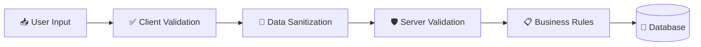
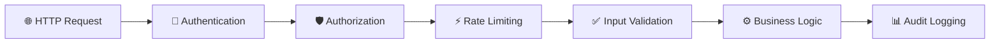

# Data Flow Diagram

```mermaid
flowchart TD
    %% External Entities
    subgraph External["External Entities"]
        User[👤 User]
        Supplier[🏢 Supplier]
        UniversitySSO[🏛️ University SSO]
        PDFInvoice[📄 PDF Invoice]
        JSONOrder[📋 JSON Order]
    end
    
    %% User Interface Layer
    subgraph UI["User Interface Layer"]
        LoginUI[🔐 Login Interface]
        DashboardUI[📊 Dashboard]
        InventoryUI[📦 Inventory Management]
        OrdersUI[📋 Orders Management]
        SalesUI[💰 Sales Processing]
        QuotesUI[📝 Quote Builder]
        UsersUI[👥 User Management]
    end
    
    %% Business Logic Layer
    subgraph Business["Business Logic Layer"]
        AuthService[🔒 Authentication Service]
        InventoryService[📦 Inventory Service]
        OrderService[📋 Order Service]
        SalesService[💰 Sales Service]
        QuoteService[📝 Quote Service]
        NotificationService[🔔 Notification Service]
        PermissionService[🛡️ Permission Service]
        InvoiceParser[📄 Invoice Parser]
    end
    
    %% Data Access Layer
    subgraph DataAccess["Data Access Layer"]
        UserRepo[👤 User Repository]
        ItemRepo[📦 Item Repository]
        OrderRepo[📋 Order Repository]
        SalesRepo[💰 Sales Repository]
        QuoteRepo[📝 Quote Repository]
        NotesRepo[📝 Notes Repository]
        AuditRepo[📊 Audit Repository]
    end
    
    %% Database Layer
    subgraph Database["Database Layer (PostgreSQL)"]
        UserTables[(👤 Users & Permissions)]
        InventoryTables[(📦 Items & Categories)]
        TransactionTables[(💰 Sales & Quotes)]
        OrderTables[(📋 Orders & Suppliers)]
        SystemTables[(⚙️ Settings & Sessions)]
        AuditTables[(📊 Movements & Logs)]
    end
    
    %% Data Flow: User Authentication
    User --> LoginUI
    LoginUI --> AuthService
    AuthService --> UniversitySSO
    UniversitySSO --> AuthService
    AuthService --> UserRepo
    UserRepo --> UserTables
    UserTables --> UserRepo
    UserRepo --> AuthService
    AuthService --> LoginUI
    LoginUI --> DashboardUI
    
    %% Data Flow: Inventory Management
    User --> InventoryUI
    InventoryUI --> InventoryService
    InventoryService --> PermissionService
    PermissionService --> UserRepo
    InventoryService --> ItemRepo
    ItemRepo --> InventoryTables
    InventoryTables --> ItemRepo
    ItemRepo --> InventoryService
    InventoryService --> AuditRepo
    AuditRepo --> AuditTables
    InventoryService --> InventoryUI
    
    %% Data Flow: Order Processing
    User --> OrdersUI
    PDFInvoice --> InvoiceParser
    JSONOrder --> OrdersUI
    OrdersUI --> OrderService
    InvoiceParser --> OrderService
    OrderService --> OrderRepo
    OrderRepo --> OrderTables
    OrderService --> ItemRepo
    OrderService --> NotificationService
    NotificationService --> UserRepo
    OrderTables --> OrderRepo
    OrderRepo --> OrderService
    OrderService --> InventoryService
    InventoryService --> AuditRepo
    OrderService --> OrdersUI
    
    %% Data Flow: Sales Processing
    User --> SalesUI
    SalesUI --> SalesService
    SalesService --> QuoteRepo
    QuoteRepo --> TransactionTables
    SalesService --> SalesRepo
    SalesRepo --> TransactionTables
    SalesService --> InventoryService
    TransactionTables --> SalesRepo
    TransactionTables --> QuoteRepo
    SalesRepo --> SalesService
    SalesService --> NotificationService
    SalesService --> SalesUI
    
    %% Data Flow: Quote Management
    User --> QuotesUI
    QuotesUI --> QuoteService
    QuoteService --> QuoteRepo
    QuoteRepo --> TransactionTables
    QuoteService --> ItemRepo
    TransactionTables --> QuoteRepo
    QuoteRepo --> QuoteService
    QuoteService --> NotesRepo
    NotesRepo --> SystemTables
    QuoteService --> QuotesUI
    
    %% Cross-cutting Data Flows
    InventoryService --> NotesRepo
    OrderService --> NotesRepo
    SalesService --> NotesRepo
    NotesRepo --> SystemTables
    SystemTables --> NotesRepo
    
    %% Real-time Updates
    subgraph Realtime["Real-time Updates"]
        WebSocket[🔄 WebSocket Connection]
        EventBus[📡 Event Bus]
        CacheLayer[⚡ Cache Layer]
    end
    
    Business --> EventBus
    EventBus --> WebSocket
    WebSocket --> UI
    DataAccess --> CacheLayer
    CacheLayer --> Business
    
    %% Styling
    classDef external fill:#ffebee,stroke:#c62828
    classDef ui fill:#e3f2fd,stroke:#1976d2
    classDef business fill:#e8f5e8,stroke:#388e3c
    classDef data fill:#fff3e0,stroke:#f57c00
    classDef database fill:#f3e5f5,stroke:#7b1fa2
    classDef realtime fill:#fce4ec,stroke:#c2185b
    
    class External external
    class UI ui
    class Business business
    class DataAccess data
    class Database database
    class Realtime realtime
```



## Key Data Flow Processes

### 1. User Authentication Flow
```
User → Login Interface → Authentication Service ↔ University SSO
Authentication Service → User Repository → User Tables
User Tables → Authentication Service → Dashboard
```

### 2. Inventory Management Flow
```
User → Inventory UI → Inventory Service → Permission Check
Inventory Service → Item Repository → Inventory Tables
Item Repository → Inventory Service → Audit Repository → Audit Tables
Inventory Service → Notification Service → User Repository
```

### 3. Order Processing Flow
```
PDF Invoice → Invoice Parser → Order Service
JSON Order → Orders UI → Order Service
Order Service → Order Repository → Order Tables
Order Service → Item Repository → Inventory Service → Stock Updates
Order Service → Notification Service → User Notifications
```

### 4. Sales Processing Flow
```
User → Sales UI → Sales Service → Quote Repository (if converting)
Sales Service → Sales Repository → Transaction Tables
Sales Service → Inventory Service → Stock Reduction → Audit Tables
Sales Service → Notification Service → Completion Notifications
```

### 5. Quote Management Flow
```
User → Quotes UI → Quote Service → Item Repository (pricing)
Quote Service → Quote Repository → Transaction Tables
Quote Service → Notes Repository → System Tables (attachments)
Quote Service → Session Management → Draft Persistence
```

## Data Transformation Points

### 1. Authentication Data
- **Input**: User credentials, SSO tokens, SAML assertions
- **Processing**: Validation, hashing, session creation
- **Output**: JWT tokens, user context, permissions
- **Storage**: Users table, sessions table, user_permissions table

### 2. Inventory Data
- **Input**: Item details, stock levels, categories
- **Processing**: Validation, SKU generation, stock calculations
- **Output**: Item records, stock movements, audit trails
- **Storage**: Items table, categories table, stock_movements table

### 3. Order Data
- **Input**: PDF invoices, JSON orders, manual entries
- **Processing**: Parsing, validation, item matching, cost calculations
- **Output**: Order records, order items, inventory updates
- **Storage**: Orders table, order_items table, stock_movements table

### 4. Sales Data
- **Input**: Quote conversions, direct sales, payment info
- **Processing**: VAT calculations, stock deductions, receipt generation
- **Output**: Sale records, sale items, inventory updates
- **Storage**: Sales table, sale_items table, stock_movements table

### 5. Quote Data
- **Input**: Item selections, quantities, pricing
- **Processing**: Cost calculations, VAT application, formatting
- **Output**: Quote documents, draft persistence, customer info
- **Storage**: Quotes table, quote_items table, session storage

## Data Validation and Security

### Input Validation


### Security Layers


## Data Consistency Mechanisms

### 1. Database Transactions
- **ACID Properties**: Atomicity, Consistency, Isolation, Durability
- **Multi-table Operations**: Order processing, sales conversion
- **Rollback Capability**: Error recovery, data integrity

### 2. Referential Integrity
- **Foreign Key Constraints**: Prevent orphaned records
- **Cascade Operations**: Controlled data deletion
- **Constraint Checking**: Real-time validation

### 3. Audit Trails
- **Stock Movements**: Every inventory change tracked
- **User Actions**: Authentication, permissions, modifications
- **System Events**: Errors, performance metrics, security events

### 4. Caching Strategy
- **Read-heavy Data**: Items, categories, user permissions
- **Cache Invalidation**: Real-time updates, consistency maintenance
- **Performance Optimization**: Reduced database load

## Error Handling and Recovery

### 1. Data Validation Errors
- **Client-side**: Immediate feedback, form validation
- **Server-side**: Comprehensive validation, error responses
- **Database-level**: Constraint violations, type errors

### 2. Business Logic Errors
- **Insufficient Stock**: Inventory availability checks
- **Permission Denied**: Role-based access control
- **Invalid Operations**: State validation, workflow enforcement

### 3. System Errors
- **Database Connectivity**: Connection pooling, retry mechanisms
- **External Services**: Fallback strategies, graceful degradation
- **Performance Issues**: Query optimization, resource management

### 4. Recovery Mechanisms
- **Transaction Rollback**: Failed operation recovery
- **Data Backup**: Regular snapshots, point-in-time recovery
- **System Monitoring**: Health checks, alerting systems
