# Database Entity Relationship Diagram

```mermaid
erDiagram
    %% Core User Management
    users ||--o{ user_permissions : "has permissions"
    users ||--o{ items : "creates/updates"
    users ||--o{ stock_movements : "performs"
    users ||--o{ sales : "processes"
    users ||--o{ quotes : "creates/processes"
    users ||--o{ orders : "creates/receives"
    users ||--o{ chargecodes : "authorises"
    users ||--o{ charge_code_exclusions : "creates"
    users ||--o{ notes : "creates"
    
    %% Permission System
    permission_definitions ||--o{ user_permissions : "defines"
    
    %% Category System
    categories ||--o{ items : "categorizes"
    categories ||--o{ order_items : "applies to"
    categories ||--o{ charge_code_exclusions : "excludes"
    
    %% Item Management
    items ||--o{ stock_movements : "tracks changes"
    items ||--o{ sale_items : "sold as"
    items ||--o{ quote_items : "quoted as"
    items ||--o{ order_items : "ordered as"
    items ||--o{ sources : "supplied by"
    
    %% Supplier Relationships
    suppliers ||--o{ sources : "supplies items"
    suppliers ||--o{ orders : "receives orders"
    
    %% Sales System
    sales ||--o{ sale_items : "contains"
    
    %% Quote System  
    quotes ||--o{ quote_items : "contains"
    
    %% Order Management
    orders ||--o{ order_items : "contains"
    
    %% Charge Codes
    chargecodes ||--o{ charge_code_exclusions : "has exclusions"
    chargecodes ||--o{ charge_code_authorized_users : "has authorized users"
    chargecodes ||--o{ charge_code_assignments : "assigned to users"
    chargecodes ||--o{ sales : "charged to"
    chargecodes ||--o{ quotes : "charged to"

    %% Archive Jobs
    users ||--o{ archive_jobs : "creates"
    
    %% Notes System (polymorphic)
    notes ||--o{ items : "references"
    notes ||--o{ suppliers : "references"
    notes ||--o{ orders : "references"
    notes ||--o{ chargecodes : "references"
    notes ||--o{ quotes : "references"
    notes ||--o{ sales : "references"
    notes ||--o{ sources : "references"

    %% Entity Details
    users {
        string id PK
        string email UK
        string password_hash "nullable"
        string first_name
        string last_name
        string role "default: user"
        boolean is_active "default: true"
        boolean must_change_password "default: false"
        timestamp last_login
        string profile_image_url
        timestamp created_at
        timestamp updated_at
    }
    
    categories {
        serial id PK
        string name UK
        string description
        string icon "default: fas fa-box"
        string color "default: blue"
        timestamp created_at
        timestamp updated_at
    }
    
    items {
        serial id PK
        string name
        string sku UK
        string description
        integer category_id FK
        decimal price
        decimal vat_rate "default: 0.2000"
        boolean vat_included "default: true"
        decimal current_stock "default: 0.00"
        decimal minimum_stock "default: 0.00"
        string unit "default: pieces"
        string location "physical location"
        boolean is_active "default: true"
        timestamp low_stock_acknowledged_at
        integer notes_id FK
        string created_by FK
        string updated_by FK
        timestamp created_at
        timestamp updated_at
    }
    
    stock_movements {
        serial id PK
        integer item_id FK
        string type "in/out/adjustment"
        integer quantity
        integer previous_stock
        integer new_stock
        string reason
        string performed_by FK
        timestamp created_at
    }
    
    sales {
        serial id PK
        string sale_id UK "format: S202501291234"
        string charge_code
        decimal subtotal_amount
        decimal vat_amount "default: 0.00"
        decimal total_amount
        boolean vat_applied "default: true"
        jsonb customer_info
        integer notes_id FK
        string status "default: completed"
        boolean is_paid "default: false"
        string processed_by FK
        string delivered_to "recipient name"
        string delivered_to_email "recipient email"
        timestamp delivered_at
        timestamp created_at
        timestamp updated_at
    }
    
    sale_items {
        serial id PK
        integer sale_id FK
        integer item_id FK
        string item_name "snapshot"
        string item_sku "snapshot"
        decimal unit_price "snapshot"
        decimal vat_rate "snapshot"
        decimal vat_amount
        integer quantity
        decimal subtotal
        decimal total_with_vat
        timestamp created_at
    }
    
    quotes {
        serial id PK
        string quote_id UK "format: Q202501291234"
        string quote_name "user-friendly name"
        string charge_code
        decimal subtotal_amount
        decimal vat_amount "default: 0.00"
        decimal total_amount
        boolean vat_applied "default: true"
        jsonb customer_info
        integer notes_id FK
        string status "default: draft"
        string session_id "for draft quotes"
        timestamp last_accessed_at
        timestamp expires_at
        string created_by FK
        string processed_by FK
        timestamp processed_at
        timestamp created_at
        timestamp updated_at
    }
    
    quote_items {
        serial id PK
        integer quote_id FK
        integer item_id FK
        string item_name "snapshot"
        string item_sku "snapshot"
        decimal unit_price "snapshot"
        decimal vat_rate "snapshot"
        decimal vat_amount
        integer quantity
        decimal subtotal
        decimal total_with_vat
        timestamp created_at
    }
    
    suppliers {
        string id PK
        string name
        string contact
        string email
        string phone
        string address
        string account_number
        integer notes_id FK
        timestamp created_at
        timestamp updated_at
    }
    
    sources {
        serial id PK
        integer item_id FK
        string supplier_id FK
        decimal price
        integer notes_id FK
        timestamp created_at
    }
    
    orders {
        serial id PK
        string order_id UK "format: O202501291234"
        string supplier_id FK
        string status "default: pending"
        integer notes_id FK
        decimal total_amount
        decimal delivery_charge "default: 0"
        string invoice_pdf_path
        string created_by FK
        string received_by FK
        timestamp received_at
        timestamp created_at
        timestamp updated_at
    }
    
    order_items {
        serial id PK
        integer order_id FK
        integer item_id FK "nullable"
        string item_name
        string item_sku
        string vendor_sku "vendor part number"
        string item_description
        integer category_id FK
        decimal unit_cost
        decimal quantity
        decimal total_cost
        boolean received "default: false"
        decimal received_quantity
        timestamp created_at
        timestamp updated_at
    }
    
    chargecodes {
        string code PK
        string title
        string authorised_by FK
        timestamp valid_from
        timestamp valid_until
        string pin
        string cost_centre
        string activity
        string cat3
        integer notes_id FK
        boolean on_hold "default: false"
        text hold_reason
        timestamp held_at
        string held_by FK
        timestamp created_at
        timestamp updated_at
    }
    
    charge_code_exclusions {
        serial id PK
        string charge_code FK
        integer category_id FK
        string created_by FK
        timestamp created_at
    }
    
    notes {
        serial id PK
        string text
        string reference_type
        string reference_id
        string created_by FK
        timestamp created_at
        timestamp updated_at
    }
    
    user_permissions {
        serial id PK
        string user_id FK
        string permission
        boolean granted "default: true"
        string granted_by FK
        timestamp created_at
        timestamp updated_at
    }
    
    permission_definitions {
        serial id PK
        string name UK
        string description
        string category
        jsonb default_roles
        timestamp created_at
        timestamp updated_at
    }
    
    system_settings {
        serial id PK
        string key UK
        jsonb value
        string description
        string category "default: general"
        boolean is_system "default: false"
        timestamp created_at
        timestamp updated_at
    }
    
    sessions {
        string sid PK
        jsonb sess
        timestamp expire
    }

    charge_code_authorized_users {
        serial id PK
        string charge_code FK
        string user_name
        string email
        string department
        text notes
        string created_by FK
        timestamp created_at
        timestamp updated_at
    }

    charge_code_assignments {
        serial id PK
        string user_id FK
        string charge_code FK
        string assigned_by FK
        timestamp assigned_at
        text notes
    }

    archive_jobs {
        serial id PK
        string archive_name
        string archive_path
        integer age_threshold_days
        jsonb records_archived
        integer archive_size_bytes
        string status
        string created_by FK
        timestamp created_at
        boolean deleted_from_db
        timestamp deleted_at
        string deleted_by FK
        text error_message
    }
```

## Key Relationships

### Core Entity Flow
1. **Users** are the central entity managing all operations
2. **Categories** organize **Items** for better management
3. **Items** are the core inventory entities with stock tracking
4. **Stock Movements** provide audit trail for all inventory changes

### Business Process Flow
1. **Quotes** → **Sales** (conversion workflow)
2. **Orders** → **Stock Movements** → **Items** (procurement workflow)
3. **Suppliers** supply **Items** via **Sources** junction table

### Permission & Security Flow
1. **Permission Definitions** define available permissions
2. **User Permissions** grant specific permissions to users
3. **Charge Code Exclusions** restrict budget usage by category

### Notes System (Polymorphic)
- Single **Notes** table references any entity type via `reference_type` and `reference_id`
- Entities link back via optional `notes_id` foreign key

## Data Integrity Features
- Foreign key constraints maintain referential integrity
- Unique constraints prevent duplicate SKUs, emails, charge codes
- Soft deletes using `is_active` flags preserve audit history
- Timestamp tracking for audit trails
- Snapshot fields in sales/quotes preserve historical data
