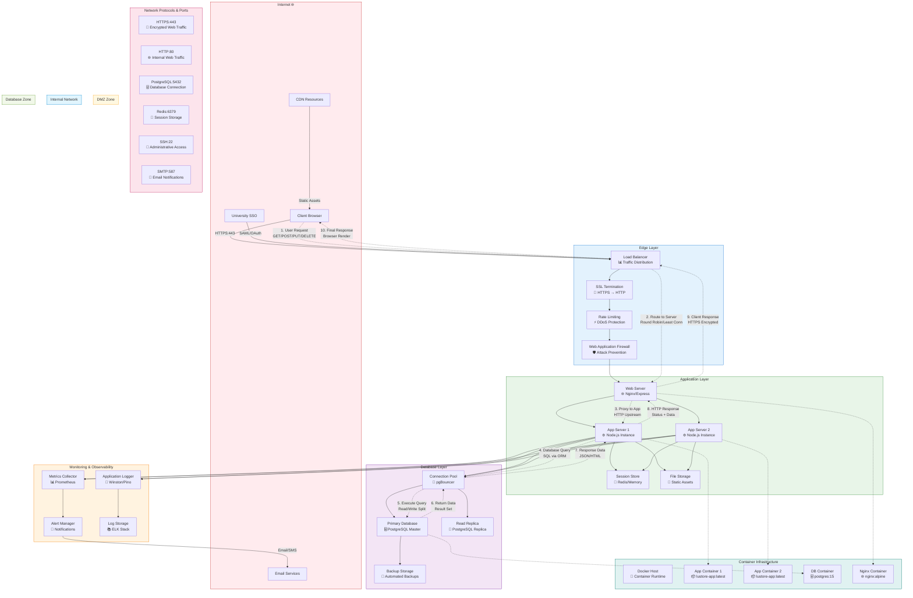

# Network Flow Diagram

## Network Architecture Components

### **Internet Layer**
- **Client Browsers**: End user access via modern web browsers
- **University SSO**: External identity provider integration
- **CDN**: Content delivery network for static assets
- **Email Services**: External SMTP for notifications

### **Edge Layer (DMZ)**
- **Load Balancer**: Traffic distribution and high availability
- **SSL Termination**: HTTPS certificate handling and encryption
- **Rate Limiting**: API throttling and abuse prevention
- **Web Application Firewall**: Layer 7 attack protection

### **Application Layer (Internal Network)**
- **Web Server**: Nginx reverse proxy and static content
- **Application Servers**: Node.js instances with load balancing
- **Session Store**: Redis/in-memory session management
- **File Storage**: Document and asset storage system

### **Database Layer (Secure Zone)**
- **Primary Database**: PostgreSQL master for writes
- **Read Replica**: PostgreSQL replica for read scaling
- **Backup Storage**: Automated backup and recovery
- **Connection Pooling**: Database connection optimization

### **Monitoring & Observability**
- **Application Logging**: Structured logging with Winston/Pino
- **Metrics Collection**: Prometheus-compatible metrics
- **Alerting**: Automated incident response
- **Log Aggregation**: Centralized log analysis

## Network Security

### **Security Zones**
1. **DMZ Zone**: Public-facing services with restricted access
2. **Internal Network**: Application services with controlled access
3. **Database Zone**: Highly restricted data layer access

### **Network Protocols**
- **HTTPS (443)**: Encrypted client communication
- **HTTP (80)**: Internal service communication
- **PostgreSQL (5432)**: Database connections
- **Redis (6379)**: Session storage access
- **SSH (22)**: Administrative access
- **SMTP (587)**: Email notifications

### **Traffic Flow Security**
1. **Ingress Filtering**: Only allowed protocols and ports
2. **SSL/TLS Encryption**: End-to-end encryption
3. **Internal Segmentation**: Network isolation between layers
4. **Database Access Control**: Restricted database connectivity
5. **Monitoring & Logging**: All network activity logged

## High Availability & Scaling

### **Load Balancing**
- **Algorithm**: Round-robin or least connections
- **Health Checks**: Automatic failure detection
- **Session Affinity**: Sticky sessions when needed
- **SSL Passthrough**: Certificate handling options

### **Horizontal Scaling**
- **Application Servers**: Multiple Node.js instances
- **Database Replicas**: Read scaling capabilities
- **Container Orchestration**: Docker Swarm/Kubernetes ready
- **Auto-scaling**: Traffic-based scaling triggers

### **Failover Mechanisms**
- **Database Failover**: Primary to replica promotion
- **Application Failover**: Automatic server replacement
- **Session Persistence**: Redis clustering for session HA
- **Backup & Recovery**: Automated disaster recovery

## Performance Optimization

### **Caching Strategy**
- **CDN Caching**: Static asset distribution
- **Application Caching**: Redis/memory caching
- **Database Query Caching**: ORM-level caching
- **Browser Caching**: HTTP cache headers

### **Connection Management**
- **Keep-Alive Connections**: HTTP connection reuse
- **Connection Pooling**: Database connection efficiency
- **Compression**: Gzip/Brotli response compression
- **Minification**: CSS/JS optimization

### **Monitoring Points**
- **Response Times**: End-to-end latency tracking
- **Throughput**: Requests per second metrics
- **Error Rates**: 4xx/5xx error monitoring
- **Resource Usage**: CPU, memory, disk utilization
