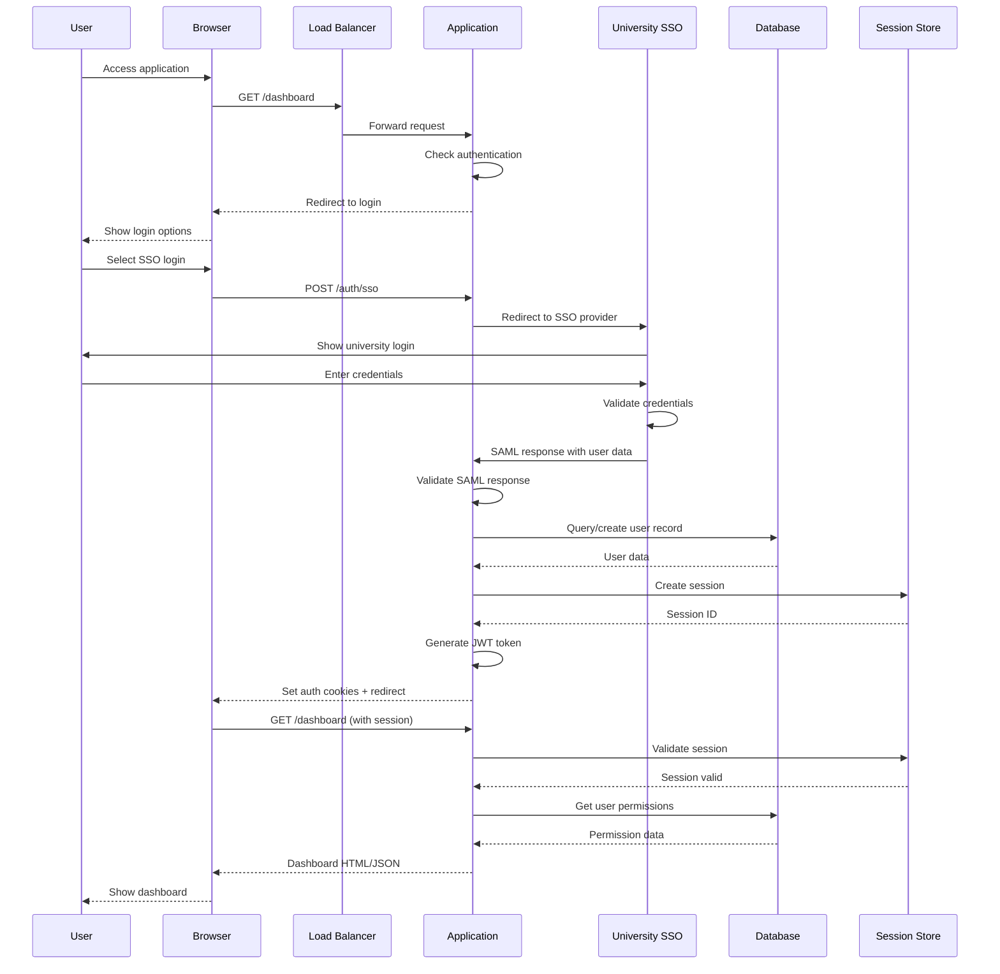
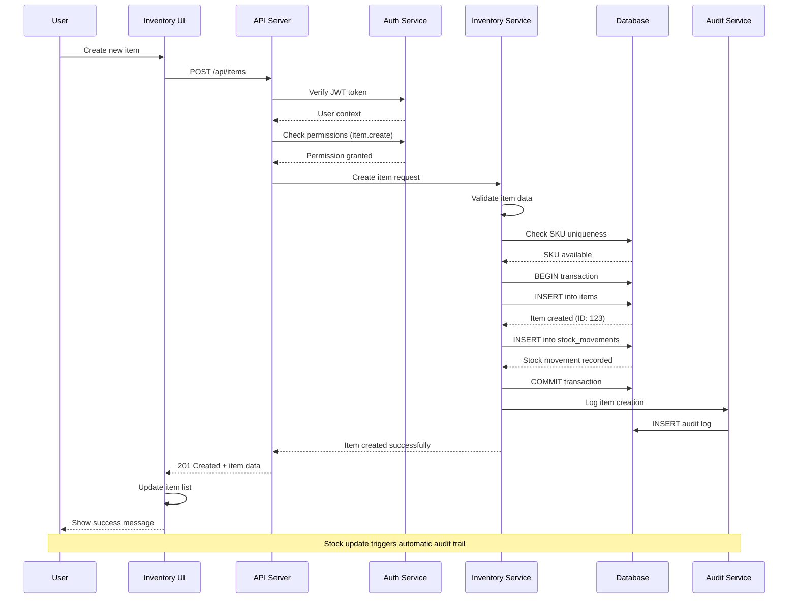
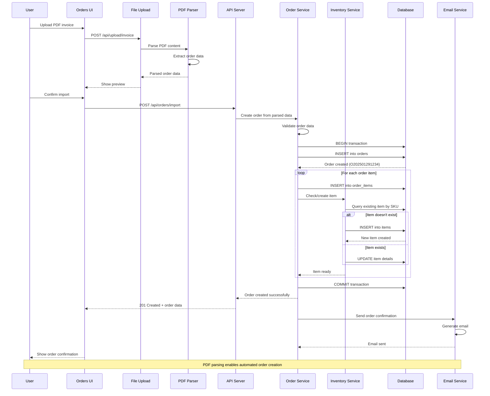
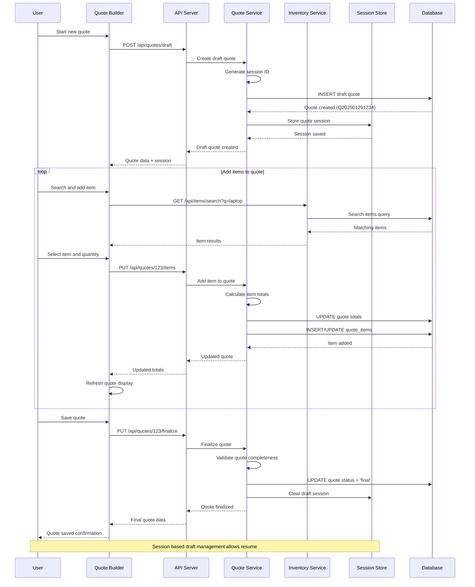

# Sequence Diagrams - User Workflows

## 1. User Authentication Sequence



## 2. Inventory Management Sequence



## 3. Order Processing Sequence



## 4. Sales Transaction Sequence

```mermaid
sequenceDiagram
    participant U as User
    participant UI as Sales UI
    participant API as API Server
    participant Sales as Sales Service
    parameter Inventory as Inventory Service
    participant Quote as Quote Service
    participant DB as Database
    participant Receipt as Receipt Service

    U->>UI: Convert quote to sale
    UI->>API: POST /api/quotes/123/convert
    API->>Quote: Get quote details
    Quote->>DB: SELECT quote and items
    DB-->>Quote: Quote data
    Quote-->>API: Quote details
    
    API->>Sales: Create sale from quote
    Sales->>Sales: Calculate VAT and totals
    Sales->>DB: BEGIN transaction
    
    Sales->>DB: INSERT into sales
    DB-->>Sales: Sale created (S202501291234)
    
    loop For each sale item
        Sales->>DB: INSERT into sale_items
        Sales->>Inventory: Check stock availability
        Inventory->>DB: SELECT current_stock
        DB-->>Inventory: Stock level
        
        alt Sufficient stock
            Inventory->>DB: UPDATE current_stock
            Inventory->>DB: INSERT stock_movement
            DB-->>Inventory: Stock updated
        else Insufficient stock
            Inventory-->>Sales: Stock shortage error
            Sales->>DB: ROLLBACK transaction
            Sales-->>API: Error response
            API-->>UI: Show error message
            UI-->>U: Stock shortage warning
        end
    end
    
    Sales->>Quote: Mark quote as processed
    Quote->>DB: UPDATE quote status
    Sales->>DB: COMMIT transaction
    
    Sales->>Receipt: Generate receipt
    Receipt->>Receipt: Create PDF receipt
    Receipt-->>Sales: Receipt URL
    
    Sales-->>API: Sale completed
    API-->>UI: 201 Created + sale data
    UI->>UI: Show receipt download
    UI-->>U: Transaction complete
    
    Note over U,Receipt: Automatic stock deduction and receipt generation
```

## 5. Quote Creation and Management Sequence



## 6. User Management and Permissions Sequence

```mermaid
sequenceDiagram
    participant Admin as Admin User
    participant UI as Admin UI
    participant API as API Server
    participant Auth as Auth Service
    participant User as User Service
    participant Permission as Permission Service
    parameter DB as Database
    participant Audit as Audit Service

    Admin->>UI: Create new user
    UI->>API: POST /api/users
    API->>Auth: Verify admin permissions
    Auth->>DB: Check user role and permissions
    DB-->>Auth: Admin confirmed
    Auth-->>API: Admin access granted
    
    API->>User: Create user request
    User->>User: Validate user data
    User->>DB: Check email uniqueness
    DB-->>User: Email available
    
    User->>DB: BEGIN transaction
    User->>DB: INSERT into users
    DB-->>User: User created (ID: user_456)
    
    User->>Permission: Assign default permissions
    Permission->>DB: SELECT default permissions for role
    DB-->>Permission: Default permission list
    
    loop For each default permission
        Permission->>DB: INSERT into user_permissions
        DB-->>Permission: Permission granted
    end
    
    User->>DB: COMMIT transaction
    User->>Audit: Log user creation
    Audit->>DB: INSERT audit log
    
    User-->>API: User created successfully
    API-->>UI: 201 Created + user data
    UI-->>Admin: Show user creation success
    
    Admin->>UI: Modify user permissions
    UI->>API: PUT /api/users/456/permissions
    API->>Permission: Update user permissions
    Permission->>DB: UPDATE user_permissions
    Permission->>Audit: Log permission change
    Audit->>DB: INSERT audit log
    Permission-->>API: Permissions updated
    API-->>UI: Permission change confirmed
    UI-->>Admin: Show permission update success
    
    Note over Admin,Audit: All user management actions are audited
```

## Sequence Diagram Insights

### **Common Patterns**

1. **Authentication Check**: Every API call validates user authentication and permissions
2. **Transaction Management**: Database operations use transactions for data consistency
3. **Audit Logging**: Critical actions are logged for compliance and debugging
4. **Error Handling**: Each sequence includes error paths and rollback mechanisms
5. **Real-time Updates**: UI updates reflect server-side changes immediately

### **Performance Optimizations**

1. **Bulk Operations**: Order processing handles multiple items in single transaction
2. **Caching**: Session store reduces database queries for user context
3. **Lazy Loading**: Item searches only fetch when needed
4. **Connection Pooling**: Database connections are reused across requests

### **Security Measures**

1. **Token Validation**: JWT tokens verified on every request
2. **Permission Checking**: Role-based access control enforced
3. **Input Validation**: All user input validated before processing
4. **Audit Trails**: Security-relevant actions logged for compliance

### **Data Consistency**

1. **ACID Transactions**: Multi-table operations use database transactions
2. **Stock Management**: Inventory changes trigger automatic audit records
3. **Referential Integrity**: Foreign key constraints maintain data relationships
4. **Optimistic Concurrency**: Race conditions handled with appropriate locking
