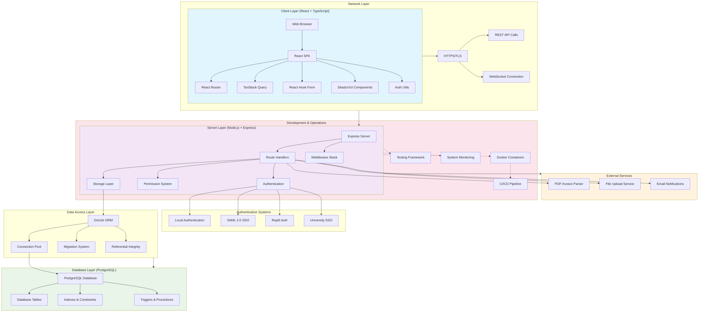

# System Architecture Flow Diagram

## Architecture Components

### Client Layer (Frontend)
- **React SPA**: Single Page Application with modern React features
- **React Router**: Client-side routing and navigation
- **TanStack Query**: Server state management, caching, and synchronization
- **React Hook Form**: Form handling with validation
- **Shadcn/UI**: Consistent component library with Tailwind CSS
- **Auth Utils**: Client-side authentication helpers

### Network Layer
- **HTTPS/TLS**: Secure communication protocol
- **REST API**: RESTful API endpoints for data operations  
- **WebSocket**: Real-time communication (optional for future features)

### Server Layer (Backend)
- **Express Server**: Node.js web framework
- **Route Handlers**: API endpoint implementations
- **Middleware Stack**: Authentication, logging, error handling
- **Authentication**: Multi-provider auth system
- **Permission System**: Role-based access control
- **Storage Layer**: Data access abstraction

### Authentication Systems
- **Local Authentication**: Username/password with JWT
- **SAML 2.0 SSO**: Enterprise single sign-on
- **Replit Auth**: Replit platform integration
- **University SSO**: Academic institution integration

### Data Access Layer
- **Drizzle ORM**: Type-safe database operations
- **Connection Pool**: Efficient database connections
- **Migration System**: Schema version control
- **Referential Integrity**: Data consistency management

### Database Layer
- **PostgreSQL**: Primary data store
- **Database Tables**: Normalized relational schema
- **Indexes & Constraints**: Performance and integrity
- **Triggers & Procedures**: Business logic enforcement

### External Services
- **PDF Invoice Parser**: Document processing for orders
- **File Upload Service**: Asset and document management
- **Email Notifications**: User communication

### Development & Operations
- **Docker Containers**: Containerized deployment
- **CI/CD Pipeline**: Automated testing and deployment
- **Testing Framework**: Unit, integration, and E2E tests
- **System Monitoring**: Health checks and performance tracking

## Key Design Principles

1. **Separation of Concerns**: Clear boundaries between layers
2. **Type Safety**: TypeScript throughout the stack
3. **Security First**: Multiple authentication methods, permission system
4. **Performance**: Connection pooling, query optimization, caching
5. **Maintainability**: Clean architecture, consistent patterns
6. **Scalability**: Microservice-ready, database optimization
7. **Reliability**: Error handling, referential integrity, audit trails
