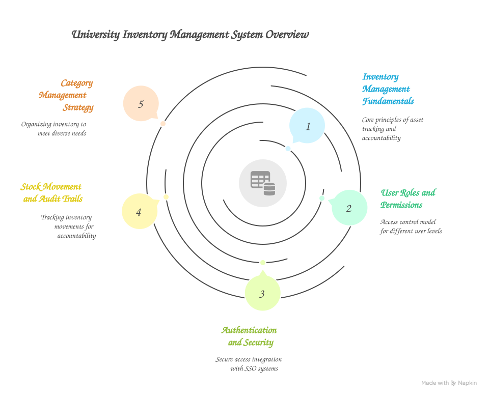

Key Concepts and Explanations
=============================

This section explains the fundamental concepts, design decisions, and business logic behind the University Inventory Management System.

Inventory Management Fundamentals
---------------------------------

What is University Inventory Management?
~~~~~~~~~~~~~~~~~~~~~~~~~~~~~~~~~~~~~~~~

University inventory management involves tracking, organizing, and controlling physical assets across campus departments. Unlike commercial inventory systems focused on sales, university systems prioritize:

**Asset Accountability**
   Every item must be tracked for financial reporting, insurance, and regulatory compliance. Universities are accountable to taxpayers, donors, and regulatory bodies for proper asset stewardship.

**Departmental Allocation**
   Resources are distributed across multiple departments with different budgets, purposes, and management structures. The system must support this distributed ownership model.

**Long-term Asset Tracking**
   University equipment often has long lifecycles (5-10 years for computers, 20+ years for furniture). The system maintains historical records for the entire asset lifecycle.

**Compliance and Auditing**
   Universities face regular audits from internal, external, and governmental agencies. Complete audit trails are essential for demonstrating proper fiscal responsibility.

User Roles and Permissions
--------------------------

Role-Based Access Control (RBAC)
~~~~~~~~~~~~~~~~~~~~~~~~~~~~~~~~

The system implements a three-tier permission model designed for university organizational structures:

**User Role (Read-Only Access)**
   Faculty, staff, and students who need visibility into inventory for planning and requisitioning.

**Manager Role (Operational Management)**
   Department managers, lab supervisors, and inventory coordinators who actively manage inventory.

**Admin Role (System Administration)**
   IT administrators, senior inventory managers, and system owners with full system access.

Authentication and Security
---------------------------

Single Sign-On (SSO) Integration
~~~~~~~~~~~~~~~~~~~~~~~~~~~~~~~~

Universities typically use centralized identity management systems. The inventory system integrates with these systems to provide seamless, secure access through SAML 2.0 protocol.

Sales and Quote Lifecycle
--------------------------

Understanding Quote Stages
~~~~~~~~~~~~~~~~~~~~~~~~~~~

The system implements a sophisticated three-tier quote and sales lifecycle that separates temporary shopping carts, persistent quotes, and completed sales:

**1. Draft Quotes (Session-Based, Temporary)**

Draft quotes are temporary, session-based shopping carts that provide a fluid user experience:

* **Session-Tied**: Linked to your browser session via ``sessionId``
* **Auto-Created**: Automatically created when you add your first item
* **4-Hour Expiration**: Expires after 4 hours of inactivity
* **No Reservation**: Items are validated but not reserved - stock can change
* **Status**: Not persisted with status (exists only in current session)
* **Use Case**: Quick transactions where you're ready to complete immediately

**2. Saved Quotes (Persistent, Named)**

Saved quotes are persistent database records that can be managed long-term:

* **Named**: Descriptive name for easy reference (e.g., "Biology Lab Equipment - Spring 2025")
* **Persistent**: Stored in database, doesn't expire
* **Customer Info**: Includes customer name, email, department
* **Editable**: Can be modified, duplicated, or deleted
* **Status**: ``saved``
* **Use Case**: Quotes requiring approval, recurring orders, multi-step workflows

**3. Completed Sales (Immutable, Stock Deducted)**

Completed sales are finalized transactions with immediate inventory impact:

* **Immutable**: Cannot be edited (only refunded via special workflow)
* **Stock Deduction**: Inventory immediately reduced
* **Audit Trail**: Full stock movement records created
* **Snapshot**: Item details captured at time of sale (price, VAT, name, SKU, location, unit)
* **Status**: ``completed``
* **Charge Code**: Validated and locked in
* **Use Case**: Final transaction - items leaving the stockroom

**4. Paid Sales (Reconciled to Charge Code)**

Paid sales indicate completed accounting reconciliation:

* **Same as Completed**: All completed sale features apply
* **isPaid Flag**: Set to ``true`` after reconciliation
* **Accounting Complete**: Charge code billing finalized
* **Financial Tracking**: Shows in paid reports for billing
* **Use Case**: After accounting department reconciles to budget

Payment vs Reconciliation
~~~~~~~~~~~~~~~~~~~~~~~~~~

.. important::
   **Critical Business Logic**: "Completing a sale" and "marking as paid" are separate steps with different meanings:

**Completing a Sale (Physical)**:
   - **What it means**: Items physically leave the stockroom
   - **When it happens**: When quote is processed
   - **Effect**: Stock levels decrease immediately
   - **Database**: ``status = 'completed'``, ``isPaid = false``
   - **Who does it**: User creating the sale

**Marking as Paid (Financial)**:
   - **What it means**: Accounting reconciliation to charge code
   - **When it happens**: Days/weeks later during financial reconciliation
   - **Effect**: Sale marked for billing, no stock change
   - **Database**: ``isPaid = true``
   - **Who does it**: Admin/manager during reconciliation

**Why They're Separate**:

1. **Workflow Flexibility**: Physical distribution happens immediately, financial reconciliation follows departmental approval workflows
2. **Accounting Timing**: Month-end reconciliation, inter-departmental billing cycles
3. **Audit Trail**: Clear distinction between inventory movement and financial settlement
4. **Approval Chains**: Sales may require management approval before marking as paid

Charge Code System
-------------------

The Accounting Gate for All Sales
~~~~~~~~~~~~~~~~~~~~~~~~~~~~~~~~~~

Every sale MUST have a valid charge code. This is the critical accounting gate that links sales to departmental budgets.

**What Charge Codes Are**:
   Alphanumeric codes (e.g., "CS-2025-Q1", "BIO-LAB-SPRING") that link sales to:

   * Departmental budgets (which department is paying)
   * Grant funding (research grants, sponsored projects)
   * Cost centers (internal cost allocation)
   * Financial accounts (for accounting and billing)

**Why They're Critical**:

1. **Financial Accountability**: Every sale tied to a budget line
2. **Audit Compliance**: Required for financial audits and reporting
3. **Budget Management**: Prevents overspending on unauthorized accounts
4. **Cost Recovery**: Enables inter-departmental billing
5. **Grant Tracking**: Links expenses to specific research grants

Charge Code Validation Rules
~~~~~~~~~~~~~~~~~~~~~~~~~~~~~

When processing a quote, the system validates charge codes through multiple checks:

**1. Existence Validation**:
   * Code must exist in ``chargecodes`` table
   * Case-sensitive matching

**2. Time Validity Window**:
   * ``validFrom``: Code not yet active if current date before this
   * ``validUntil``: Code expired if current date after this
   * Allows fiscal year or project-specific timeframes

**3. Hold Status Check**:
   * ``isOnHold`` flag: Temporarily disabled
   * ``holdReason``: Explanation (e.g., "Budget freeze pending approval")
   * Use case: Budget overruns, pending renewals

**4. Category Exclusions**:
   * ``charge_code_exclusions`` table: Blocks certain codes from certain item categories
   * Example: "Office Supplies" code cannot be used for "IT Equipment" category
   * Enforces budget allocation rules

**5. User Authorization** (Permission System):
   * ``charge_code_assignments`` table: Maps users to allowed codes
   * Basic users: Restricted to assigned codes only
   * Managers: Access to all codes
   * Admins: Full access plus assignment management

**6. PIN Protection** (Optional):
   * High-value codes may require PIN entry
   * Additional security layer

.. warning::
   **Charge Code Errors Block Sales**: If validation fails, the quote cannot be processed. Resolve the error before proceeding.

Item Storage and Physical Tracking
-----------------------------------

Location Field (Physical Tracking)
~~~~~~~~~~~~~~~~~~~~~~~~~~~~~~~~~~~

The ``location`` field tracks physical storage locations for inventory items:

**Purpose**:
   * Physical warehouse location (e.g., "Room 204, Shelf B3, Bin 12")
   * Enables efficient picking and stock takes
   * Reduces time searching for items

**Format**: Free text (room, shelf, bin, aisle, coordinates, etc.)

**Usage**:
   * **Admin-Only Visibility**: Location shown in inventory management (admin users)
   * **Sale Conversion**: Location included in printouts/exports when processing quotes
   * **Picking Lists**: Staff can locate items quickly using printed locations

**Example Locations**:

.. code-block:: text

   IT Equipment:
   - "IT Storage Room A, Rack 3, Shelf 2"
   - "Server Room, Cage 4, Bin C12"

   Lab Supplies:
   - "Chemistry Lab 205, Cabinet B, Shelf 3"
   - "Bio Storage, Cold Room 2, Shelf A"

   Office Supplies:
   - "Main Office, Supply Closet, Shelf 5"

Unit Field (Measurement Type)
~~~~~~~~~~~~~~~~~~~~~~~~~~~~~~

The ``unit`` field specifies the measurement unit for quantities:

**Purpose**:
   * Clarifies how quantities are measured (pieces, kg, meters, liters)
   * Prevents confusion with non-countable items
   * Ensures correct quantity interpretation

**Supported Units**:
   * **Countable**: pieces, units, items, boxes, packages
   * **Weight**: kg, grams, pounds, ounces
   * **Length**: meters, feet, centimeters, inches
   * **Volume**: liters, gallons, milliliters
   * **Area**: square meters, square feet

**Usage**:
   * Displayed alongside quantities in all views
   * Included in sale item snapshots
   * Shown in reports and exports

**Example with Units**:

.. code-block:: text

   Item: Ethernet Cable CAT6
   Current Stock: 150 meters  ← Unit clarifies measurement
   Sale Quantity: 15.5 meters ← Decimal quantity makes sense

   Item: Office Chair
   Current Stock: 24 pieces  ← Countable unit
   Sale Quantity: 2 pieces   ← Integer quantity

**Why It Matters**:
   Without units, "2.5" is ambiguous. Is it 2.5 meters of cable or 2.5 chairs? The unit field prevents errors.

Stock Movement and Audit Trails
--------------------------------

Complete Audit Trail for Compliance
~~~~~~~~~~~~~~~~~~~~~~~~~~~~~~~~~~~~

Every inventory movement is recorded in the ``stock_movements`` table for financial accountability, regulatory compliance, and operational efficiency.

**What's Recorded**:

* **Who**: ``performedBy`` (user ID who made the change)
* **When**: ``timestamp`` (exact date/time)
* **What**: ``itemId``, ``previousStock``, ``newStock``
* **Why**: ``reason`` (linked to sale ID, order ID, or manual adjustment note)
* **Type**: ``type`` ('in' for received, 'out' for sold, 'adjustment' for manual)

**Use Cases**:

1. **Financial Audits**: Prove all stock movements are legitimate
2. **Discrepancy Investigation**: "What happened to item X?"
3. **Physical Inventory**: Reconcile physical counts with system records
4. **Compliance**: Demonstrate proper asset stewardship

**Example Audit Trail**:

.. code-block:: text

   Item: Lab Microscope (SKU: LAB-MICRO-001)

   2025-01-15 10:30  | User: admin@university.edu    | Type: in         | Previous: 0   | New: 10   | Reason: "Received Order #O202501151230"
   2025-01-20 14:45  | User: biology@university.edu  | Type: out        | Previous: 10  | New: 8    | Reason: "Sale #S202501201445"
   2025-01-25 09:00  | User: admin@university.edu    | Type: adjustment | Previous: 8   | New: 7    | Reason: "Physical count found 1 damaged unit"
   2025-01-28 16:20  | User: biology@university.edu  | Type: out        | Previous: 7   | New: 5    | Reason: "Sale #S202501281620"

VAT (Value Added Tax) Handling
-------------------------------

Complex Price Interpretation
~~~~~~~~~~~~~~~~~~~~~~~~~~~~~

VAT in the system is not just a simple percentage - it's a price interpretation system that handles both VAT-inclusive and VAT-exclusive pricing.

**The Challenge**:
   Different suppliers and regions handle VAT differently:

   * **UK Model**: Prices often include VAT (price shown is final)
   * **US Model**: Prices exclude tax (tax added at checkout)
   * **Mixed Model**: Some items VAT-inclusive, others exclusive

**System Solution**:

Each item has two VAT-related fields:

1. ``vatRate``: Percentage (e.g., 0.20 for 20%, 0.05 for 5% reduced rate)
2. ``vatIncluded``: Boolean (true = price includes VAT, false = VAT added to price)

**Calculation Logic**:

**If ``vatIncluded = true`` (Price Includes VAT)**:

.. code-block:: text

   Display Price: £120.00 (this is what customer pays)
   VAT Rate: 20%

   Calculation:
   - Net Price = £120.00 / 1.20 = £100.00
   - VAT Amount = £100.00 × 0.20 = £20.00
   - Total = £120.00 (as displayed)

**If ``vatIncluded = false`` (VAT Added to Price)**:

.. code-block:: text

   Display Price: £100.00 (base price)
   VAT Rate: 20%

   Calculation:
   - Net Price = £100.00
   - VAT Amount = £100.00 × 0.20 = £20.00
   - Total = £100.00 + £20.00 = £120.00 (customer pays)

**Per-Item VAT Rates**:

Different items can have different VAT rates:

* **Standard Rate (20%)**: Most goods and services
* **Reduced Rate (5%)**: Energy-saving materials, children's car seats
* **Zero Rate (0%)**: Books, newspapers, most food
* **Exempt**: Financial services, education (not tracked as VAT)

**Sale Item Snapshots**:

When a sale is processed, the system captures:

* ``unitPrice``: Price at time of sale (immutable)
* ``vatRate``: Rate at time of sale (immutable)
* ``vatIncluded``: Calculation method (immutable)

This ensures historical accuracy even if item prices or VAT rates change later.

Category Management Strategy
-----------------------------

Categories reflect the diverse needs of academic institutions, from laboratory equipment to administrative supplies, organized to support both operational workflows and financial reporting requirements.

Role-Based Access and Permissions
----------------------------------

Three-Tier Permission System
~~~~~~~~~~~~~~~~~~~~~~~~~~~~~

The system now implements a sophisticated three-tier permission model with charge code isolation:

**User Role (Basic Access)**:
   * **Charge Code Restriction**: Can only use assigned charge codes (via ``charge_code_assignments`` table)
   * **Sales**: Can create sales/quotes with assigned charge codes only
   * **Inventory**: Read-only view
   * **Reports**: Cannot access
   * **Use Case**: Department staff, students

**Manager Role (Operations)**:
   * **Charge Code Access**: All charge codes available
   * **Sales**: Full access to sales, quotes, and reports
   * **Orders**: Can create and receive purchase orders
   * **Inventory**: Can edit items and stock levels
   * **Reports**: Full access to analytics and reports
   * **Users**: Cannot manage users
   * **Use Case**: Department managers, lab supervisors

**System Admin Role (Full Control)**:
   * **All Manager Permissions**: Plus user management
   * **User Management**: Create, edit, delete users
   * **Charge Code Assignment**: Assign/remove charge codes from users
   * **System Configuration**: Settings, categories, backup
   * **Full Access**: No restrictions
   * **Use Case**: IT administrators, senior inventory managers

